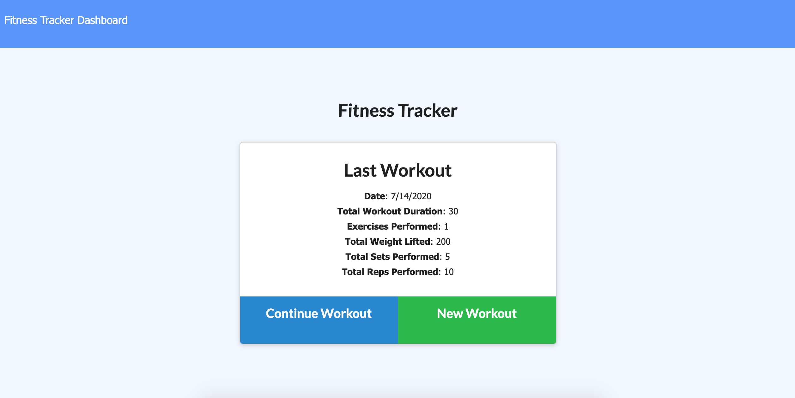
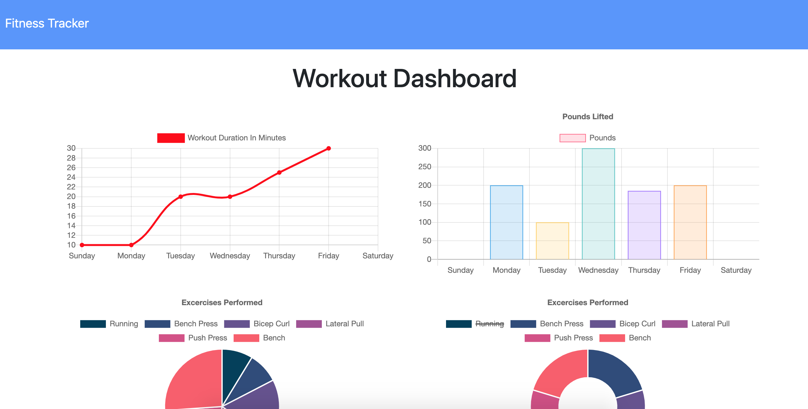

# Unit 17 Nosql Homework: Workout Tracker

In this workout tracker, users are able to create and track daily workouts. They can log multiple exercises in a workout on a given day. Users can also track the name, type, weight, sets, reps, and duration of exericse. For example, if the exercise is a cardio exercise, they should be able to track their distance traveled.

## Getting Started

The application is deployed on Heroku. https://bibliotheque-chaise-37450.herokuapp.com/

## Technologies
  
  * NodeJS
  * ExpressJs
  * MongoDB
  * ChartJS

## Functionality

When the user loads the page, they should be given the option to create a new workout, or continue with their last workout.

The users are able to:

  * Add exercises to a previous workout plan.

  * Add new exercises to a new workout plan.

  * View multiple the combined weight of multiple exercises on the `stats` page.

